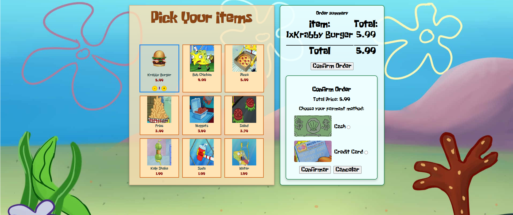

# 🚀 Mini Projects Vue

This repository contains a collection of small projects developed with **Vue.js**. Each project covers different features and scenarios to help improve understanding and usage of Vue.js in web applications. New projects will be added as development progresses.

## 📂 Current Projects

### 1. 🍔🦀 Self Service Machine (Krusty Krab Self-Order System)

The **Self Service Machine** simulates a self-service system like those used in restaurants like McDonald's, but at the bottom of the sea. In this project, the user can view available products, adjust quantities and see the order summary. This is the first project in the collection and was developed with the following features:

#### 🔧 Features:

- **Vue.js 3** for dynamic rendering and state management.
- A simple interface where customers can view the product menu.
- Quantity manipulation for each item in the order.
- Display of a list of products and their prices.
- Automatic calculation of the order total based on the user's selections.

#### 🛠️ Technologies Used:

- **Vue.js 3** via CDN
- **HTML5** and **CSS3** for structure and styling
- **JavaScript** for logic and state management

### 2. 🎧 Spotify Song Search

The **Spotify Song Search** allows users to search for song information using the Spotify API. This project fetches data such as the song's name, album, artist(s), duration, and popularity based on user input. It provides a dynamic and interactive interface to explore Spotify's music database.

#### 🔧 Features:

- **Vue.js 3** for dynamic rendering and API integration.
- Integration with the **Spotify API** for real-time song information retrieval.
- A responsive input form where users enter the song name to search.
- Display of detailed song information, including:
  - Song name
  - Album name
  - Artists
  - Duration (in minutes and seconds)
  - Popularity score
  - Album cover image

#### 🛠️ Technologies Used:

- **Vue.js 3** via CDN
- **HTML5** and **CSS3** for responsive structure and styling
- **JavaScript** for API calls and logic handling
- **Spotify API** for accessing song data

#### ⚠️ Important Note:

To run this project, you need to create your own Spotify API credentials (Client ID and Client Secret). If you prefer, you can use my API credentials—just send me a message on my social media profiles [Profile](https://github.com/Agos091), which are linked on my [LinkedIn](https://www.linkedin.com/in/agos-dalcin-rufino-a9913821a/).

## 🖥️ How to Run the Project:

1. Clone this repository:
   ```bash
   git clone https://github.com/Agos091/mini-projects-vue.git
   ```
   Open the project in your preferred code editor.
   Run the index.html file in your browser using a local server (you can use the Live Server extension in VS Code).
   Access the self-service system and explore its functionalities!

🔍 Recommended Tools:
Vue Dev Tools: We highly recommend using the Vue Dev Tools to inspect and debug the Vue components in your browser. It provides a user-friendly interface for tracking the state, events, and structure of your Vue app.
Live Server: For quick local development, use the Live Server extension in VS Code to auto-reload the page when changes are made.

📅 Upcoming Projects
We plan to add more practical projects using Vue.js. Follow the repository for new updates!

Stay tuned for more! 🌟

Connect with me on [LinkedIn](https://www.linkedin.com/in/agos-dalcin-rufino-a9913821a/).
🤝 Contributions
Contributions are welcome! If you have any suggestions or want to collaborate, feel free to open an issue or submit a pull request.

A small preview projects:


